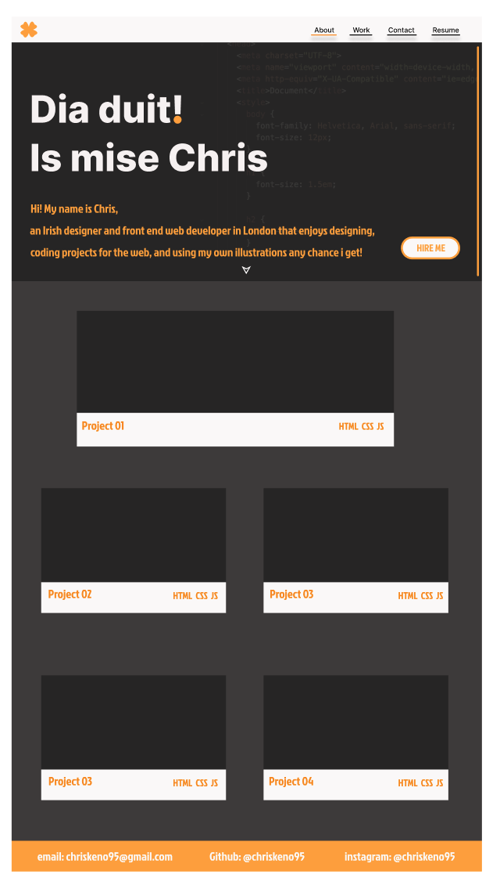
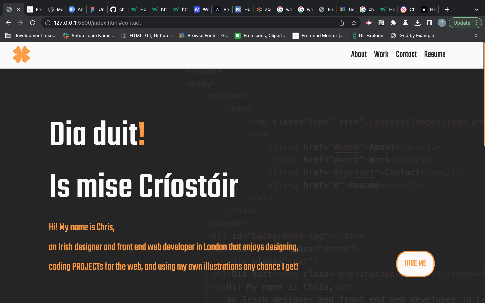
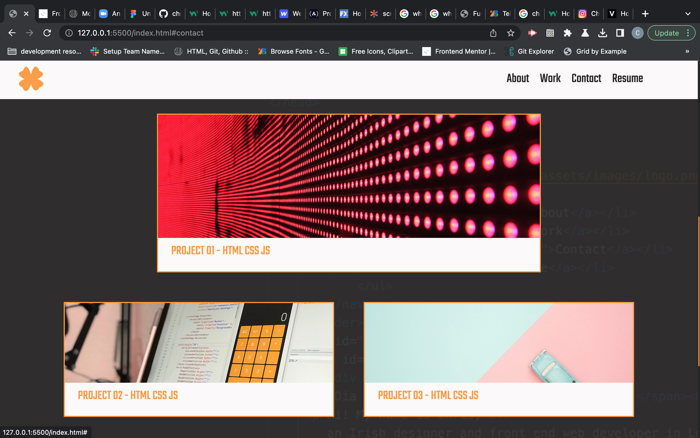
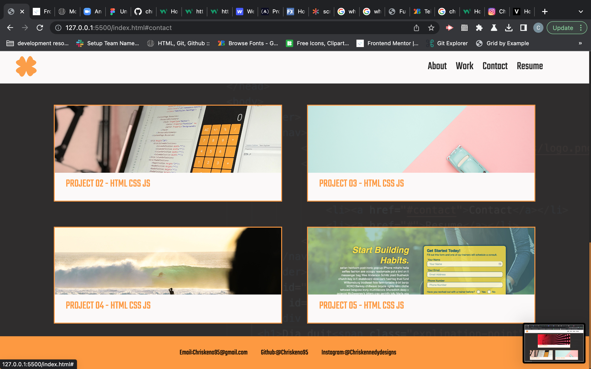

# Personal Portfolio

## Description 

This is my personal porfolio that i have created for the second week of the front end web development bootcamp course. I have combined what i have been learning for the past 2 weeks into this project. I have decided for this project to create my own design and push myself with coding it to try and get it as close to my wireframe as much as possible with the knowledge that i currently have.

Through the process of this project, i have learned a little about Figma (which i have used to make my wireframe), i would usually use illustrator to create wireframes however i decided to try something new. i have also learned how to use code to design default page elements such as the browsers scroll bar to get it to look how i wanted.

The reason i have decided to stray from the briefs design is to create something that stands out more, has abit more of my personality and allows me to test my knowledge. It also makes it abit more enjoyable for me as i want to get back to my design roots. 

While completing this project i struggled with the responsiveness of the webpage and this is something i will work on as the bootcamp progresses. 

## Table of Contents

* [Installation](#installation)
* [Wireframe](#wireframe)
* [Screenshots](#screenshots)
* [License](#license)

## Installation

No need to install anything to view this project; you can view it [here](https://chriskeno95.github.io/personal-portfolio/)

## Wireframe 

Here is the wireframe that i created as a visual aid while completing this project

## Screenshots

## License

MIT licence

---

© 2022 edX Boot Camps LLC. Confidential and Proprietary. All Rights Reserved.
